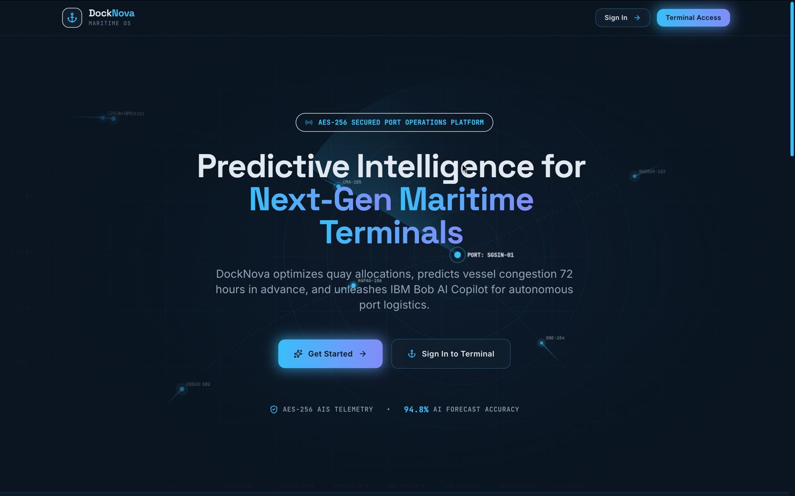
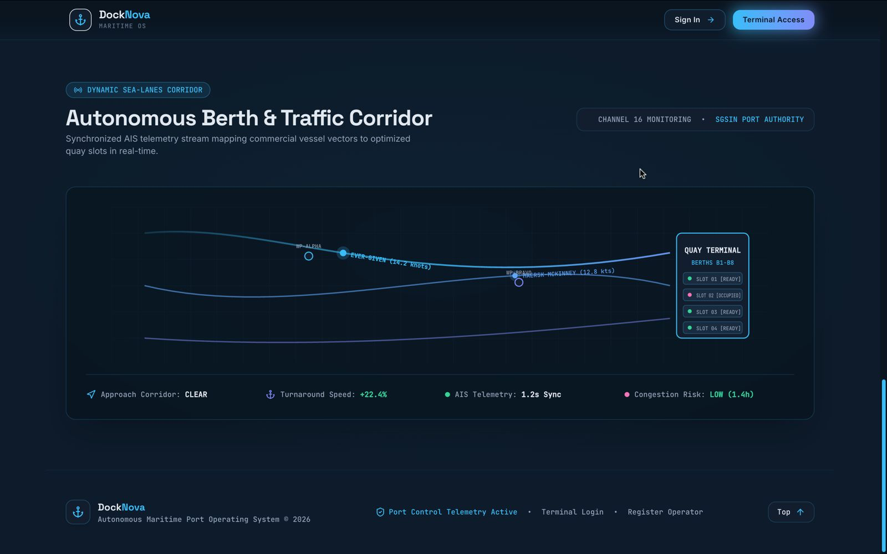
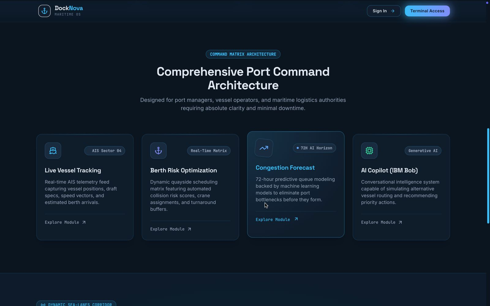

# 📸 DockNova — Platform Screenshots & Visual Walkthrough

This directory contains full-resolution UI screenshots demonstrating DockNova's live **Port Operations Control Tower**, **AI 72-Hour Congestion Predictor**, **Google OR-Tools CP-SAT Solver**, **IBM Bob AI Copilot**, and **System Administration Console**.

---

## 📋 Screenshot Directory Table

| # | Screenshot File | View / Feature | Key Capabilities Highlighted |
|---|---|---|---|
| **1** | [`LANDING-1.png`](LANDING-1.png) | **Platform Hero Landing Page** | Dark theme hero, AIS telemetry indicator, live 94.8% AI accuracy score, quick role login access. |
| **2** | [`LANDING-2.png`](LANDING-2.png) | **Autonomous Berth & Traffic Corridor** | Live vessel approach vectors, AIS stream telemetry, turnaround speed boost metric, channel monitoring. |
| **3** | [`LANDING-3.png`](LANDING-3.png) | **Port Command Architecture** | Feature module cards: Live Vessel Tracking, Berth Risk Optimization, Congestion Forecast, IBM Bob Copilot. |
| **4** | [`MANAGER DASHBOARD.png`](MANAGER%20DASHBOARD.png) | **Port Control Tower (Manager View)** | Real-time KPIs (Total Vessels, Queue, Berth Utilization, Yard Occupancy), 72h risk trend chart, berth risk matrix. |
| **5** | [`72-Hours PLAN.png`](72-Hours%20PLAN.png) | **72-Hour Congestion Prediction** | Hourly risk-horizon forecasting, peak bottleneck windows, expected wait times, queue growth models. |
| **6** | [`OPERATION PLAN.png`](OPERATION%20PLAN.png) | **AI 72-Hour Operations Planner** | Mathematical berth & crane schedule optimization (Google OR-Tools CP-SAT) with before/after efficiency gains. |
| **7** | [`SYSTEM ADMIN DASHBOARD.png`](SYSTEM%20ADMIN%20DASHBOARD.png) | **System Mission Control** | Admin telemetry, model accuracy over time (96.4%), 24h prediction volume, active drift alerts. |
| **8** | [`SYSTEM ADMIN DASHBOARD-2.png`](SYSTEM%20ADMIN%20DASHBOARD-2.png) | **Terminal Utilization & Performance** | Regional berth share, user seat growth metrics, and top-performing terminal throughput leaderboards. |
| **9** | [`VERCEL DASHBOARD.png`](VERCEL%20DASHBOARD.png) | **Carrier Operations Dashboard** | Vessel Operator fleet view: active vessels, upcoming arrivals (<24h), radar risk map, 7-day fleet status trends. |

---

## 🖼️ Visual Walkthrough

### 1. Platform Landing Page — Hero Section

*Figure 1: DockNova landing page featuring live telemetry status and platform entrance.*

---

### 2. Autonomous Berth & Traffic Corridor

*Figure 2: Real-time AIS sea-lanes corridor tracking approaching container vessels.*

---

### 3. Comprehensive Port Command Architecture

*Figure 3: Platform core capabilities overview highlighting vessel tracking, risk optimization, and AI copilot.*

---

### 4. Port Control Tower — Manager Dashboard

*Figure 4: Real-time port control room dashboard with live KPI counters, berth risk matrix, and vessel queue status.*

---

### 5. 72-Hour Congestion Forecast Engine

*Figure 5: Hourly predictive queue modeling and 72-hour risk horizon.*

---

### 6. AI 72-Hour Operations Planner (Google OR-Tools CP-SAT)

*Figure 6: Exact mathematical constraint solver allocating berths and cranes under physical draft and length limits.*

---

### 7. System Mission Control & Model Accuracy

*Figure 7: System Administration console tracking ML model accuracy over time and prediction volume telemetry.*

---

### 8. Terminal Utilization & Performance Leaderboards

*Figure 8: Regional terminal performance metrics, berth share distribution, and system alert feed.*

---

### 9. Carrier Operations Dashboard (Vessel Operator View)

*Figure 9: Vessel Operator view detailing active fleet status, upcoming arrivals, radar risk matrix, and 7-day trends.*
