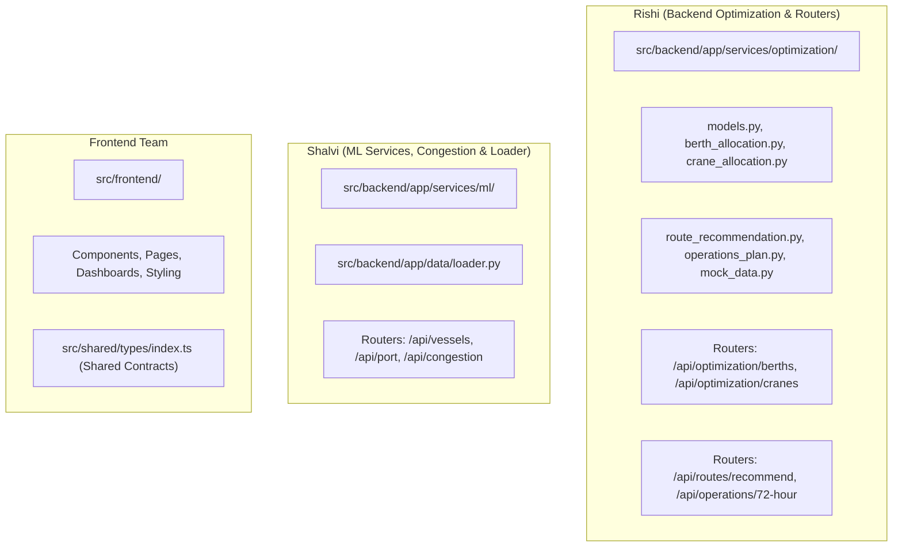

# DockNova Project Contract & Schema Specification

> **Status:** Active / Authoritative Reference  
> **Last Updated:** Current Codebase State (Commit: Optimization Services Pass)

---

## §1. Overview

This document defines the authoritative data schemas, model contracts, and planned API endpoint specifications for DockNova as of the current codebase state. It is created retroactively based on the existing Python Pydantic models in [`src/backend/app/services/optimization/models.py`](file:///Users/rishi/Downloads/bob-ai-hackathon-DockNova/src/backend/app/services/optimization/models.py), mock data in [`src/backend/app/services/optimization/mock_data.py`](file:///Users/rishi/Downloads/bob-ai-hackathon-DockNova/src/backend/app/services/optimization/mock_data.py), and TypeScript interfaces in [`src/shared/types/index.ts`](file:///Users/rishi/Downloads/bob-ai-hackathon-DockNova/src/shared/types/index.ts). This document reflects the actual implemented Python schemas built across recent backend optimization passes and serves as the single source of truth for frontend-backend integration.

---

## §2. Schema Gaps — Needs Frontend Type

The following schemas and model fields exist in the backend models ([`models.py`](file:///Users/rishi/Downloads/bob-ai-hackathon-DockNova/src/backend/app/services/optimization/models.py)) but are missing or incomplete in the shared TypeScript definitions ([`src/shared/types/index.ts`](file:///Users/rishi/Downloads/bob-ai-hackathon-DockNova/src/shared/types/index.ts)). These gaps require frontend interface definitions to support complete API communication.

### 1. `RouteRecommendation` (and sub-models `AlternativePort`, `Recommendation`)
* **Backend Status:** Defined in [`models.py`](file:///Users/rishi/Downloads/bob-ai-hackathon-DockNova/src/backend/app/services/optimization/models.py#L261-L284) and implemented in `route_recommendation.py`.
* **Shared Type Status:** **MISSING** from `src/shared/types/index.ts`.
* **Action Required:** Frontend team needs to add `RouteRecommendation`, `AlternativePort`, and `Recommendation` interfaces to TypeScript types.

### 2. `OperationsPlanEntry` (and `PlanEntryStatus`)
* **Backend Status:** Defined in [`models.py`](file:///Users/rishi/Downloads/bob-ai-hackathon-DockNova/src/backend/app/services/optimization/models.py#L298-L322) for per-vessel breakdown items in 72-hour operational plans.
* **Shared Type Status:** **PARTIAL / INCOMPLETE**. `src/shared/types/index.ts` has a high-level `OperationsPlan` summary interface (`id`, `generatedAt`, `validForHours`, `recommendationsCount`, `status`), but lacks the granular per-vessel `OperationsPlanEntry` type returned by `GET /api/operations/72-hour`.
* **Action Required:** Add `OperationsPlanEntry` and `PlanEntryStatus` to `src/shared/types/index.ts`.

### 3. `CraneOptimizationResult` & Detailed Breakdown Types
* **Backend Status:** Defined in [`models.py`](file:///Users/rishi/Downloads/bob-ai-hackathon-DockNova/src/backend/app/services/optimization/models.py#L213-L237) along with `BerthAssignment`, `CraneAssignment`, `MetricsSnapshot`, and `CraneMetricsSnapshot`.
* **Shared Type Status:** **SUMMARY ONLY**. `src/shared/types/index.ts` defines `OptimisationResult` with top-level metrics only (`id`, `timestamp`, `efficiencyGainPercentage`, `estimatedWaitTimeReductionHours`). It lacks `assignments` array and `before_metrics`/`after_metrics` snapshots.
* **Action Required:** Extend TypeScript `OptimisationResult` to include detailed assignments and metrics snapshots, or declare separate TypeScript interfaces for `BerthAssignment` and `CraneAssignment`.

### 4. Extra Fields on Existing Core Models
* **`Vessel`:** Backend `VesselModel` includes `priority` (`HIGH` | `MEDIUM` | `LOW`) and `estimated_handling_hours` (`float`). `src/shared/types/index.ts` `Vessel` interface lacks both fields.
* **`Berth`:** Backend `BerthModel` includes `compatible_vessel_types` (`list[str]`), `availability_start` (`datetime`), and `availability_end` (`datetime`). `src/shared/types/index.ts` `Berth` interface lacks these fields.

### 5. Naming Convention Mapping (`snake_case` vs `camelCase`)
* Backend Pydantic models use standard Python `snake_case` (`draft_meters`, `max_draft_meters`, `capacity_teu_per_hour`).
* Frontend TypeScript interfaces use JavaScript `camelCase` (`draftMeters`, `maxDraftMeters`, `capacityTEUPerHour`).
* **Recommendation:** Configure Pydantic `alias_generator` or FastAPI response encoders, or handle camelCase translation in the API response envelope layer.

---

## §3. Core Schemas

Below are the authoritative field definitions from [`models.py`](file:///Users/rishi/Downloads/bob-ai-hackathon-DockNova/src/backend/app/services/optimization/models.py) alongside realistic example JSON objects matching [`mock_data.py`](file:///Users/rishi/Downloads/bob-ai-hackathon-DockNova/src/backend/app/services/optimization/mock_data.py).

### 1. Vessel (`VesselModel`)

| Field Name | Backend Type | Required / Default | Description |
| :--- | :--- | :--- | :--- |
| `id` | `str` | Required | Unique vessel identifier (e.g. "V001") |
| `name` | `str` | Required | Vessel vessel name |
| `imo` | `str` | Required | International Maritime Organization number |
| `type` | `str` | Required | Vessel type (`CONTAINER`, `TANKER`, `BULK`, `RORO`) |
| `eta` | `datetime` (ISO 8601) | Required | Estimated Time of Arrival |
| `etd` | `datetime` (ISO 8601) | Required | Estimated Time of Departure |
| `status` | `VesselStatus` (Enum) | Required | `SCHEDULED`, `WAITING`, `BERTHED`, `DEPARTED` |
| `draft_meters` | `float` | Required (>= 0) | Vessel water draft in meters |
| `length_meters` | `float` | Required (>= 0) | Vessel length overall (LOA) in meters |
| `priority` | `Priority` (Enum) | Default: `MEDIUM` | Priority classification (`HIGH`, `MEDIUM`, `LOW`) |
| `estimated_handling_hours` | `float` | Default: `12.0` | Estimated total handling time at berth |

**Example JSON Object:**
```json
{
  "id": "V001",
  "name": "MSC Flaminia",
  "imo": "9467419",
  "type": "CONTAINER",
  "eta": "2025-07-15T06:00:00Z",
  "etd": "2025-07-16T00:00:00Z",
  "status": "WAITING",
  "draft_meters": 14.5,
  "length_meters": 316.0,
  "priority": "HIGH",
  "estimated_handling_hours": 16.0
}
```

---

### 2. Berth (`BerthModel`)

| Field Name | Backend Type | Required / Default | Description |
| :--- | :--- | :--- | :--- |
| `id` | `str` | Required | Unique berth identifier (e.g. "B01") |
| `name` | `str` | Required | Human-readable berth name |
| `code` | `str` | Required | Short terminal/berth code (e.g. "CT-A") |
| `max_draft_meters` | `float` | Required (>= 0) | Maximum water depth allowed |
| `max_length_meters` | `float` | Required (>= 0) | Maximum vessel length allowed |
| `status` | `BerthStatus` (Enum) | Required | `AVAILABLE`, `OCCUPIED`, `MAINTENANCE` |
| `current_vessel_id` | `Optional[str]` | Default: `None` | ID of vessel currently berthed (if any) |
| `compatible_vessel_types` | `list[str]` | Default: all types | Supported vessel types |
| `availability_start` | `Optional[datetime]` | Default: `None` | Start of availability window |
| `availability_end` | `Optional[datetime]` | Default: `None` | End of availability window |

**Example JSON Object:**
```json
{
  "id": "B01",
  "name": "Container Terminal Alpha",
  "code": "CT-A",
  "max_draft_meters": 18.0,
  "max_length_meters": 420.0,
  "status": "AVAILABLE",
  "current_vessel_id": null,
  "compatible_vessel_types": ["CONTAINER"],
  "availability_start": "2025-07-15T06:00:00Z",
  "availability_end": "2025-07-17T06:00:00Z"
}
```

---

### 3. Crane (`CraneModel`)

| Field Name | Backend Type | Required / Default | Description |
| :--- | :--- | :--- | :--- |
| `id` | `str` | Required | Unique crane identifier (e.g. "CR01") |
| `name` | `str` | Required | Descriptive crane name |
| `berth_id` | `str` | Required | Berth to which this crane is assigned |
| `status` | `CraneStatus` (Enum) | Required | `OPERATIONAL`, `IDLE`, `MAINTENANCE` |
| `capacity_teu_per_hour` | `float` | Required (> 0) | Operational throughput in TEU/hour |

**Example JSON Object:**
```json
{
  "id": "CR01",
  "name": "STS Gantry Alpha-1",
  "berth_id": "B01",
  "status": "OPERATIONAL",
  "capacity_teu_per_hour": 30.0
}
```

---

### 4. OptimizationResult (`OptimizationResult`)

| Field Name | Backend Type | Required / Default | Description |
| :--- | :--- | :--- | :--- |
| `id` | `str` | UUID default | Unique optimization run ID |
| `timestamp` | `datetime` (ISO 8601) | UTC now default | Run execution timestamp |
| `assignments` | `list[BerthAssignment]` | Required | Array of vessel-to-berth assignments |
| `before_metrics` | `MetricsSnapshot` | Required | Pre-optimization metrics |
| `after_metrics` | `MetricsSnapshot` | Required | Post-optimization metrics |
| `efficiency_gain_percentage` | `float` | Required | Percentage improvement in berth utilization |
| `estimated_wait_time_reduction_hours` | `float` | Required | Reduction in average vessel waiting time |
| `solver_status` | `str` | Default: `"UNKNOWN"` | Solver output status (e.g. "OPTIMAL", "FEASIBLE") |

**Nested Assignment Object (`BerthAssignment`):**
* `vessel_id`: `str`, `vessel_name`: `str`, `berth_id`: `str`, `berth_name`: `str`, `start_time`: `datetime`, `end_time`: `datetime`.

**Nested Snapshot Object (`MetricsSnapshot`):**
* `waiting_vessels`: `int`, `avg_waiting_time_hours`: `float`, `berth_utilization_pct`: `float`.

**Example JSON Object:**
```json
{
  "id": "a1b2c3d4-e5f6-7890-abcd-ef1234567890",
  "timestamp": "2025-07-15T06:00:00Z",
  "assignments": [
    {
      "vessel_id": "V001",
      "vessel_name": "MSC Flaminia",
      "berth_id": "B01",
      "berth_name": "Container Terminal Alpha",
      "start_time": "2025-07-15T06:00:00Z",
      "end_time": "2025-07-15T22:00:00Z"
    }
  ],
  "before_metrics": {
    "waiting_vessels": 5,
    "avg_waiting_time_hours": 8.5,
    "berth_utilization_pct": 45.0
  },
  "after_metrics": {
    "waiting_vessels": 1,
    "avg_waiting_time_hours": 2.1,
    "berth_utilization_pct": 82.5
  },
  "efficiency_gain_percentage": 37.5,
  "estimated_wait_time_reduction_hours": 6.4,
  "solver_status": "OPTIMAL"
}
```

---

### 5. RouteRecommendation (`RouteRecommendation`)

| Field Name | Backend Type | Required / Default | Description |
| :--- | :--- | :--- | :--- |
| `id` | `str` | UUID default | Unique recommendation ID |
| `timestamp` | `datetime` (ISO 8601) | UTC now default | Generation timestamp |
| `vessel_id` | `str` | Required | Target vessel ID |
| `vessel_name` | `str` | Required | Target vessel name |
| `current_port` | `str` | Required | Current destination port name |
| `current_congestion` | `str` | Required | `LOW`, `MEDIUM`, `HIGH`, `CRITICAL` |
| `current_wait_time_hours` | `float` | Required (>= 0) | Expected wait time at current port |
| `alternatives` | `list[AlternativePort]` | Required | Array of evaluated alternative ports |
| `best_alternative` | `Optional[AlternativePort]` | Optional | Top recommended alternative (if rerouting) |
| `time_saved_hours` | `float` | Required | Net time saved by rerouting |
| `recommendation` | `Recommendation` (Enum) | Required | Action choice: `STAY` or `REROUTE` |
| `reasoning` | `str` | Required | Explanation for operational decision |

**Nested Object (`AlternativePort`):**
* `port_id`: `str`, `port_name`: `str`, `congestion_level`: `str`, `predicted_wait_time_hours`: `float`, `travel_time_hours`: `float`, `travel_cost_usd`: `float`, `available_berths`: `int`.

**Example JSON Object:**
```json
{
  "id": "f47ac10b-58cc-4372-a567-0e02b2c3d4e5",
  "timestamp": "2025-07-15T06:00:00Z",
  "vessel_id": "V001",
  "vessel_name": "MSC Flaminia",
  "current_port": "DockNova Terminal",
  "current_congestion": "HIGH",
  "current_wait_time_hours": 18.5,
  "alternatives": [
    {
      "port_id": "PORT-HAZ",
      "port_name": "Hazira Port",
      "congestion_level": "LOW",
      "predicted_wait_time_hours": 2.0,
      "travel_time_hours": 4.0,
      "travel_cost_usd": 30000.0,
      "available_berths": 2
    }
  ],
  "best_alternative": {
    "port_id": "PORT-HAZ",
    "port_name": "Hazira Port",
    "congestion_level": "LOW",
    "predicted_wait_time_hours": 2.0,
    "travel_time_hours": 4.0,
    "travel_cost_usd": 30000.0,
    "available_berths": 2
  },
  "time_saved_hours": 6.5,
  "recommendation": "REROUTE",
  "reasoning": "Rerouting to Hazira Port saves 6.5 hours of total transit/wait time despite $30,000 extra fuel cost."
}
```

---

### 6. OperationsPlanEntry (`OperationsPlanEntry`)

| Field Name | Backend Type | Required / Default | Description |
| :--- | :--- | :--- | :--- |
| `vessel_id` | `str` | Required | Assigned vessel ID |
| `vessel_name` | `str` | Required | Assigned vessel name |
| `vessel_type` | `str` | Required | Vessel classification |
| `priority` | `Priority` (Enum) | Required | Priority level (`HIGH`, `MEDIUM`, `LOW`) |
| `eta` | `datetime` (ISO 8601) | Required | Estimated arrival time |
| `etd` | `datetime` (ISO 8601) | Required | Estimated departure time |
| `berth_id` | `str` | Required | Assigned berth ID |
| `berth_name` | `str` | Required | Assigned berth name |
| `start_time` | `datetime` (ISO 8601) | Required | Operation start time |
| `end_time` | `datetime` (ISO 8601) | Required | Operation completion time |
| `crane_count` | `int` | Required (>= 0) | Number of allocated cranes |
| `crane_ids` | `list[str]` | Default: `[]` | List of allocated crane IDs |
| `service_duration_hours` | `float` | Required (>= 0) | Calculated service duration |
| `workload_teu` | `float` | Required (>= 0) | Container workload in TEU |
| `status` | `PlanEntryStatus` (Enum) | Required | `SCHEDULED`, `IN_PROGRESS`, `DELAYED`, `COMPLETED` |
| `recommended_action` | `str` | Required | Actionable instruction summary |

**Example JSON Object:**
```json
{
  "vessel_id": "V001",
  "vessel_name": "MSC Flaminia",
  "vessel_type": "CONTAINER",
  "priority": "HIGH",
  "eta": "2025-07-15T06:00:00Z",
  "etd": "2025-07-16T00:00:00Z",
  "berth_id": "B01",
  "berth_name": "Container Terminal Alpha",
  "start_time": "2025-07-15T06:00:00Z",
  "end_time": "2025-07-15T13:45:00Z",
  "crane_count": 2,
  "crane_ids": ["CR01", "CR02"],
  "service_duration_hours": 7.76,
  "workload_teu": 450.0,
  "status": "SCHEDULED",
  "recommended_action": "Assign Berth B01 with 2 cranes (CR01, CR02) for 7.8 hours"
}
```

---

## §4. Planned API Endpoints

These endpoints constitute the target API specification for upcoming backend router implementation.

### Endpoint Matrix

| Method | Endpoint Path | Request Body | Response Payload | Description |
| :--- | :--- | :--- | :--- | :--- |
| `POST` | `/api/optimization/berths` | `{ "vessel_ids"?: string[] }` | `Envelope[OptimizationResult]` | Triggers OR-Tools CP-SAT berth allocation solver |
| `POST` | `/api/optimization/cranes` | `{ "berth_id": string }` | `Envelope[OptimizationResult]` | Triggers crane allocation optimizer for specified berth |
| `POST` | `/api/routes/recommend` | `{ "vessel_id": string }` | `Envelope[RouteRecommendation]` | Computes route recommendation & alternative port comparison |
| `GET` | `/api/operations/72-hour` | None | `Envelope[OperationsPlanEntry[]]` | Retrieves combined 72-hour berth + crane operations plan |

---

### [PROPOSED STANDARD ENVELOPE]

To standardize response structure, error handling, and metadata across all backend services, all API endpoints will return responses wrapped in a standard JSON envelope.

**TypeScript Envelope Definition:**
```typescript
interface ApiResponseEnvelope<T> {
  success: boolean;
  data: T | null;
  error?: {
    code: string;
    message: string;
    details?: Record<string, unknown>;
  } | null;
  metadata?: {
    timestamp: string;
    requestId?: string;
  };
}
```

**Example Successful Response (`POST /api/routes/recommend`):**
```json
{
  "success": true,
  "data": {
    "id": "f47ac10b-58cc-4372-a567-0e02b2c3d4e5",
    "timestamp": "2025-07-15T06:00:00Z",
    "vessel_id": "V001",
    "vessel_name": "MSC Flaminia",
    "current_port": "DockNova Terminal",
    "current_congestion": "HIGH",
    "current_wait_time_hours": 18.5,
    "alternatives": [
      {
        "port_id": "PORT-HAZ",
        "port_name": "Hazira Port",
        "congestion_level": "LOW",
        "predicted_wait_time_hours": 2.0,
        "travel_time_hours": 4.0,
        "travel_cost_usd": 30000.0,
        "available_berths": 2
      }
    ],
    "best_alternative": {
      "port_id": "PORT-HAZ",
      "port_name": "Hazira Port",
      "congestion_level": "LOW",
      "predicted_wait_time_hours": 2.0,
      "travel_time_hours": 4.0,
      "travel_cost_usd": 30000.0,
      "available_berths": 2
    },
    "time_saved_hours": 6.5,
    "recommendation": "REROUTE",
    "reasoning": "Rerouting to Hazira Port saves 6.5 hours of total transit/wait time."
  },
  "error": null,
  "metadata": {
    "timestamp": "2025-07-15T06:00:00Z"
  }
}
```

**Example Error Response (`POST /api/routes/recommend`):**
```json
{
  "success": false,
  "data": null,
  "error": {
    "code": "VESSEL_NOT_FOUND",
    "message": "Vessel with ID 'V999' was not found.",
    "details": { "vessel_id": "V999" }
  },
  "metadata": {
    "timestamp": "2025-07-15T06:00:00Z"
  }
}
```

---

## §5. Ownership Map

This ownership map defines file and component responsibility across team members.



### Detailed Ownership Directory Mapping

| Owner | Path / Module | Responsibilities |
| :--- | :--- | :--- |
| **Rishi** | `src/backend/app/services/optimization/` | CP-SAT Berth Allocation, Crane Throughput Maximizer, Route Recommendation Engine, 72-Hour Operations Plan Generator, Pydantic Models ([`models.py`](file:///Users/rishi/Downloads/bob-ai-hackathon-DockNova/src/backend/app/services/optimization/models.py)), Mock Data ([`mock_data.py`](file:///Users/rishi/Downloads/bob-ai-hackathon-DockNova/src/backend/app/services/optimization/mock_data.py)), and service unit tests. |
| **Rishi** | `src/backend/app/api/routers/` (Berths, Cranes, Routes, Operations) | FastAPI router handlers for `POST /api/optimization/berths`, `POST /api/optimization/cranes`, `POST /api/routes/recommend`, `GET /api/operations/72-hour`. |
| **Shalvi** | `src/backend/app/services/ml/` | Machine learning models for congestion forecasting, ETA prediction, and risk scoring. |
| **Shalvi** | `src/backend/app/data/loader.py` | Data access layer, database connections, dataset ingestion & loading scripts. |
| **Shalvi** | `src/backend/app/api/routers/` (Vessels, Port, Congestion) | FastAPI router handlers for `/api/vessels`, `/api/port`, `/api/congestion`. |
| **Frontend**| `src/frontend/` | React dashboard application, UI components, state management, Vite & Tailwind configuration. |
| **Shared** | `src/shared/types/index.ts` & `docs/PROJECT_CONTRACT.md` | Joint contract specifications and shared TypeScript interfaces. |
