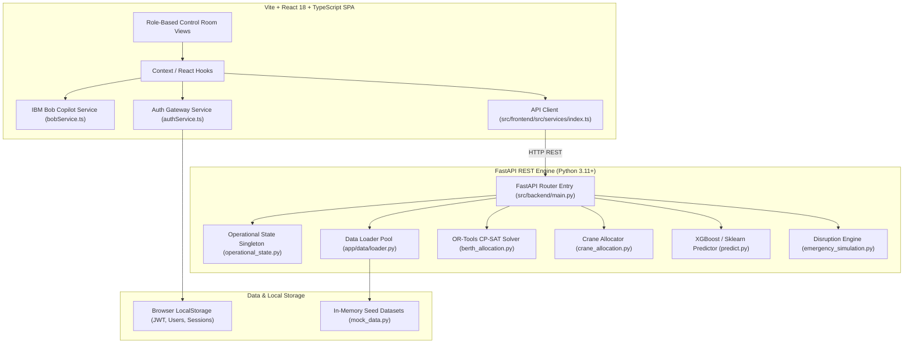

# Technical Architecture

## System Component Diagram

## Component Table

| Layer | Technology | Responsibility |
| :--- | :--- | :--- |
| Frontend Framework | React 18 + Vite | Renders the role-based control room UI with fast hot-module-reload |
| Type Safety | TypeScript 5.3 | Enforces type safety across API schemas and application state |
| Styling | Tailwind CSS 3.4 | Utility-first styling for the responsive maritime dark-mode UI |
| Animation | Framer Motion 13 | Micro-animations for real-time status changes and modal overlays |
| Data Visualization | Recharts 3.10 | Renders multi-hour congestion trend charts |
| Backend Framework | FastAPI 0.104 (Python 3.11+) | Serves the REST API and auto-generates OpenAPI documentation |
| Optimization Solver | Google OR-Tools 9.12 (CP-SAT) | Solves the NP-hard berth allocation problem exactly |
| ML Inference | XGBoost 2.0 / Scikit-Learn 1.3 | Gradient-boosted models for congestion classification and wait-time regression |
| Data Manipulation | Pandas 2.0 + NumPy 1.24 | Time-series feature aggregation and matrix transformations |
| IBM Technology | IBM Bob AI Copilot (`bobService.ts`) | Conversational assistant simulating watsonx.ai inference with contextual intent resolution and XAI output |

## API Endpoint Registry

| Route | Method | Handler | Purpose |
| :--- | :--- | :--- | :--- |
| `/health` | GET | `main.py` | Health check ping |
| `/api/vessels` | GET | `vessels.py` | Retrieve the 40-vessel scheduling pool |
| `/api/port/status` | GET | `port.py` | Port vessel count, available berths, yard occupancy % |
| `/api/port/berth-risk` | GET | `port.py` | Per-berth 0–100 formula-based risk scoring |
| `/api/congestion/forecast` | GET | `congestion.py` | 24-hour hourly ML congestion probability & wait time |
| `/api/congestion/predict` | POST | `congestion.py` | Single-vessel or port-state ML congestion prediction |
| `/api/optimization/berths` | POST | `berths.py` | Google OR-Tools CP-SAT berth allocation solver |
| `/api/optimization/cranes` | POST | `cranes.py` | Berth crane throughput & move optimization |
| `/api/operations/72-hour` | GET | `operations.py` | Combined berth & crane 72-hour master operations plan |
| `/api/routes/recommend` | POST | `routes.py` | Rerouting advisor (STAY vs REROUTE) |
| `/api/optimization/simulate` | POST | `simulation.py` | What-if fleet expansion simulation |
| `/api/emergency/simulate` | POST | `emergency.py` | Quayside emergency disruption simulator |
| `/api/live/state` | GET | `live_state.py` | Live operational clock state snapshot |

## Data Flow — End to End

### Walkthrough 1: Fetching Port Control Tower Status

1. User opens the Manager Dashboard.
2. A React `useEffect` fires in `ManagerDashboard.tsx`.
3. The API client executes `api.getPortStatus()` in `src/frontend/src/services/index.ts`.
4. An HTTP GET request is dispatched to `http://localhost:8000/api/port/status`.
5. FastAPI routes the request to `get_port_status()` in `src/backend/app/routers/port.py`.
6. The router queries the `live_state.snapshot()` singleton in `app/services/operational_state.py`.
7. A `PortStatus` JSON envelope is returned (`totalVessels=40`, `waitingVessels=12`, `availableBerths=5`).
8. The React component state updates and re-renders the KPI metric cards with animation.

### Walkthrough 2: User Authentication & Role-Gated Redirect

1. User submits the login form with email and password.
2. `LoginPage.tsx` calls `authService.login(credentials)` in `src/frontend/src/services/authService.ts`.
3. `authService` checks credentials against `getMockUsers()` stored in `localStorage`.
4. A signed mock JWT token is generated containing the user's ID, name, email, and role.
5. `AuthContext` stores the active user and token in browser state and `localStorage`.
6. `App.tsx`'s `ProtectedRoute` checks `user.role` against `allowedRoles`.
7. The user is redirected to their role page: Manager → `/manager`, Operator → `/user`, Admin → `/admin`.

## Data & Persistence Model

DockNova uses a hybrid persistence architecture: an in-memory backend operational singleton, plus a frontend LocalStorage gateway.

**Backend in-memory data models** (`src/backend/app/data/loader.py`):

| Model | Source File | Row Count | Key Fields | Depended On By |
| :--- | :--- | :--- | :--- | :--- |
| Vessels Pool | `loader.py` | 40 vessels (V001–V040) | `id, name, imo, type, eta, etd, status, draft_meters, length_meters, priority` | Vessels Page, Berth Allocator, ML Predictor |
| Berths Facility | `mock_data.py` | 5 berths (B01–B05) | `id, name, code, max_draft_meters, max_length_meters, status, compatible_vessel_types` | Berth Risk Matrix, OR-Tools Solver, Hotspots |
| Quay Cranes | `mock_data.py` | 12 cranes (CR01–CR12) | `id, name, berth_id, status, capacity_teu_per_hour` | Crane Allocator, 72-Hour Plan, Disruption Sim |
| Historical Metrics | `loader.py` | 24 hourly time-series records | `vessel_arrivals, waiting_vessels, berth_utilization_pct, yard_occupancy_pct` | ML Congestion Forecast Engine |

**Frontend LocalStorage keys** (`authService.ts`, `bobService.ts`):

- `docknova_registered_users` — persists seed accounts and new signups.
- `docknova_copilot_sessions_v1` — stores IBM Bob chat history and session state.
- `docknova_theme_user_set` — stores the active UI theme (dark/light).

## Security Notes

- Authentication is handled by `authService.ts`, which generates signed mock JWTs stored in browser `localStorage`.
- On the frontend, React Router wraps protected paths in `ProtectedRoute` components that restrict access based on the authenticated user's role (`manager`, `user`, `admin`).
- Audit-relevant events (logins, user actions, solver triggers) are recorded with SHA-256 signatures in the audit log explorer, though — as documented in the Known Limitations — this ledger is currently held in client-side mock memory rather than an external immutable store.

## Scalability & Honesty Notes

DockNova's current build is a hackathon-scope demo, and this is documented transparently rather than glossed over:

- Data persistence is **in-memory / LocalStorage**, not a production database — the 40 vessels, 5 berths, 12 cranes, and 24 hours of historical metrics are seed datasets (`mock_data.py`, `loader.py`) rather than a live feed.
- External maritime integrations (MPA, TOS Portnet, NOAA Weather, TradeNet) are simulated connectors, clearly labeled `Simulated (demo)` in the UI, rather than live network integrations.
- The IBM Bob Copilot's watsonx.ai inference is simulated client-side (`bobService.ts`) with an artificial 1500ms delay rather than a live billed watsonx endpoint call — see `docs/solution-overview.md` and the README's Known Limitations for the full disclosure.
- The genuinely real, functioning components are the FastAPI REST API, the OR-Tools CP-SAT berth/crane solvers, the XGBoost ML predictor, the live operational-state clock, and the React control room UI.
